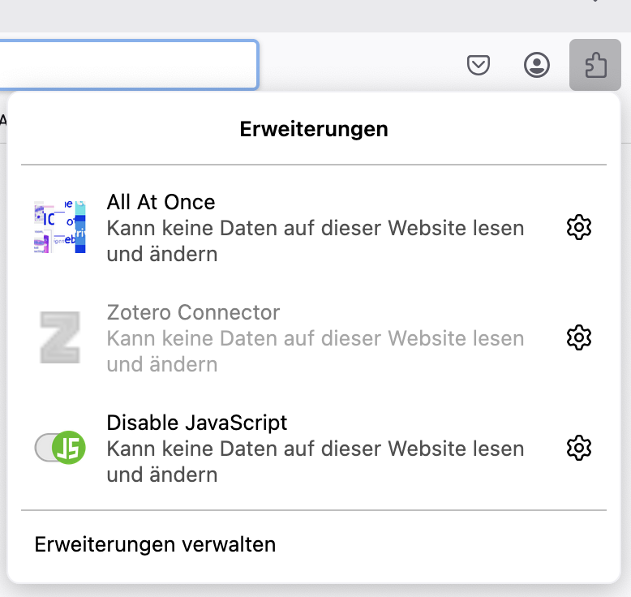

## How to start an extension when the user is clicking on the action icon?

The action icon is defined in manifest.json -- it appears on the user side in a dropdown when the user clicks on the general Extension Icon. See below<br/>
 
<br/>
The entry for the browser_action in the manifest.json and additionaly you need to give permission to have access to the active tab.

```js
    "browser_action": {
        "default_icon": "icons/blackify-96.png"
    },  
    "permissions": [
        "<all_urls>",
        "tabs"
    ],

```

In order to attach an action to this icon you need another entry in manifest.json 

```js
"background": {
        "scripts": ["background.js"]
    },

```

You then create a file called `background.js` and add a so called event Listener to the action when the user clicks. This event listener sends a message to the active Tab. In this example, the message consists of an action called `startAction`. This is supposed to be a function in the script you add to the page (the so called content script)

```js
browser.browserAction.onClicked.addListener((tab) => {
    browser.tabs.query({ active: true, currentWindow: true }).then((tabs) => {
        const activeTab = tabs[0];
        //console.log('start')
        browser.tabs.sendMessage(activeTab.id, { action: "startAction" });
      });

});

```

As a final step, you would add the content script in the manifest.json.

```js
"content_scripts": [{
        "matches": ["<all_urls>"],
        "js": ["content.js"]
    }],

```

You create a file called `content.js` and write a function named `startAction`

```js
function startAction(){
    //do something with the page
}

```