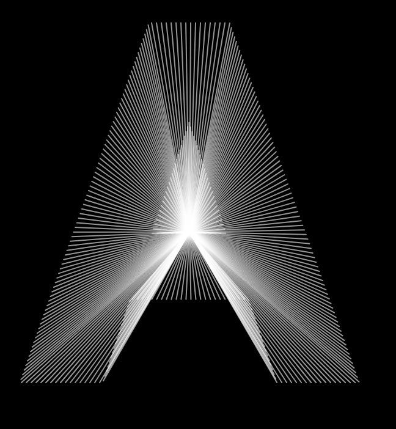
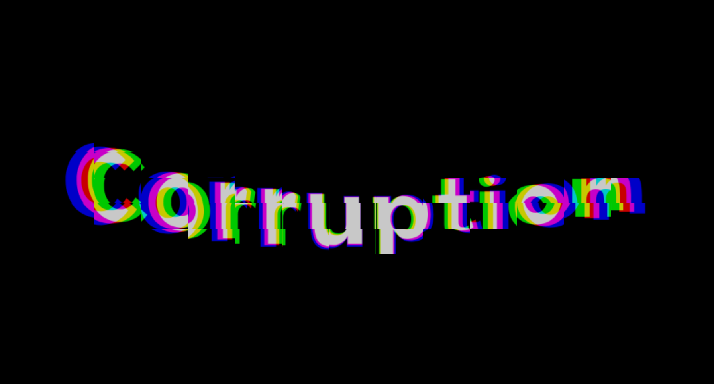

# Workshop Kinetic Type mit p5.js

## Some historical background
* Morisawa Series by John Maeda, 1996 <br/>
The Morisawa 10 series was inspired by a visit to a Shikō Munakata exhibition in Japan, and also having been fascinated by emerging methods to work with letterforms on the computer. <br/>
Quelle https://maedastudio.com/morisawa-10-2016/
* PostScript Fonts: <br/>
By using PostScript (PS) language, the glyphs are described with cubic Bézier curves (as opposed to the quadratic curves of TrueType), and thus a single set of glyphs can be resized through simple mathematical transformations, which can then be sent to a PostScript-ready printer. <br/>
Quelle https://en.wikipedia.org/wiki/PostScript_fonts

## Some examples
* https://www.badbonn.ch/ 
* https://dia.tv/
* https://praktische-ba-arbeit.netlify.app/
* https://jonathanpuckey.com/projects/typographic-rhythm/
* https://www.hansje.net/ 
* http://www.yeoahn.com/typecode/
* https://www.standardabweichung.de/design/projekte
* https://www.eliashanzer.com/phase/
* https://www.typeroom.eu/ksawery-kirklewski-generative-type-nfts-max-cooper-typographic-video-symphony-in-acid
* https://colab.munken.com/munkencreator
* https://editor.p5js.org/sojamo/collections/nsT3Ha0oZt

## Rosa Menkman Glitch Manifesto 
* Rosa Menkman, 2011, Glitch Manifesto: https://www.academia.edu/3847007/Menkman_Rosa_2011_Glitch_Studies_Manifesto


## textToPoints 
 <br/>
<a href="https://p5js.org/reference/p5.Font/textToPoints/">Reference </a>

### basic concept
```js
// Get the point array.
  let points = font.textToPoints('p5*js', 6, 60, 35, { sampleFactor:  0.5 });

```
* Boilerplate textToPoints, export SVG, <a href="textToPointsBegin.zip">Download</a>


## createGraphics 
 <br/>
<a href="https://p5js.org/reference/p5/createGraphics/">Reference </a>

### basic concept
```js
  // Create the p5.Graphics object.
  let pg = createGraphics(50, 50);

  // Draw to the graphics buffer.
  pg.background(100);
  pg.circle(pg.width / 2, pg.height / 2, 20);

  //display it
  image(pg, 25, 25);

  // or copy parts of it and display a part
  // Copy a region of pixels to another spot.
  copy(pg, 7, 22, 10, 10, 35, 25, 50, 50);
```


* Boilerplate createGraphics, export PNG, <a href="createGraphicsBegin.zip">Download</a>


## Helper 
* sinus and cosinus visually explained: https://setosa.io/ev/sine-and-cosine/
* Dat Gui to create a lightweight GUI: https://github.com/dataarts/dat.gui?tab=readme-ov-file

## Tutorials 
* textToPoints: https://www.youtube.com/watch?v=eZHclqx2eJY
* createGraphics: https://www.youtube.com/watch?v=TaluaAD9MKA


# Miroboard for Sharing 
https://miro.com/app/board/uXjVI39PB-8=/?share_link_id=190917971035 
